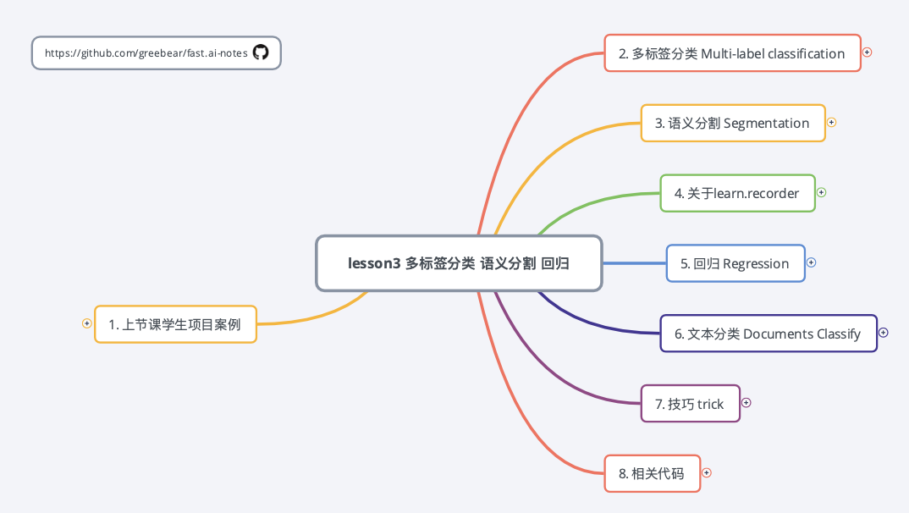
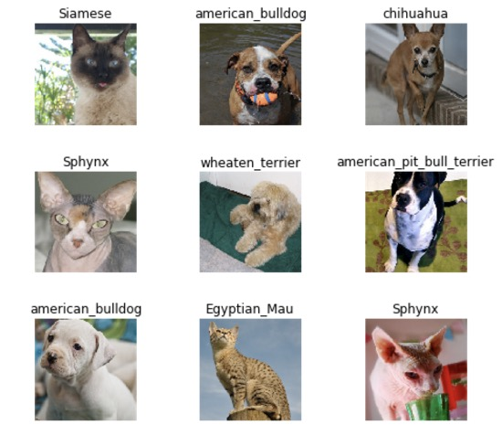
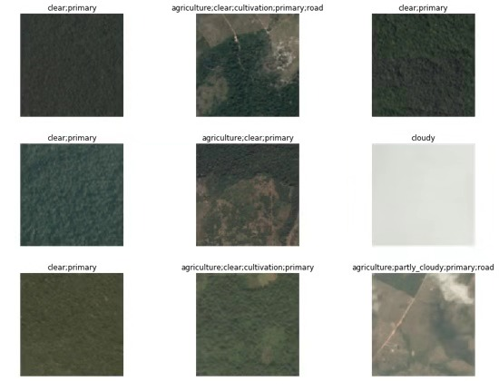

# fast.ai v3 学习笔记xmind、代码

## [**fast.ai**](http://www.fast.ai)  
Making neural nets uncool again
- Github：  [fastai](https://github.com/fastai/fastai) 
- 课程地址：  https://course.fast.ai

## 仓库简介

  

Chinese Xmind Notes for Fastai v3  
Fastai v3 中文xmind笔记  

## xmind

- Lesson1 图像分类 [[下载]](./xmind/lesson1.xmind)
- Lesson3 多标签分类 语义分割 回归 [[下载]](./xmind/lesson3.xmind)
- Lesson6 正则化 卷积 数据伦理 [[下载]](./xmind/lesson3.xmind)

## notebook

- Lesson1-细粒度图像分类-37种猫狗种类图像数据(牛津大学) [[预览]](https://nbviewer.jupyter.org/github/greebear/fast.ai-notes/blob/master/notebook/lesson1-%E7%BB%86%E7%B2%92%E5%BA%A6%E5%9B%BE%E5%83%8F%E5%88%86%E7%B1%BB-37%E7%A7%8D%E7%8C%AB%E7%8B%97%E7%A7%8D%E7%B1%BB%E5%9B%BE%E5%83%8F%E6%95%B0%E6%8D%AE(%E7%89%9B%E6%B4%A5%E5%A4%A7%E5%AD%A6).ipynb)  
.ipynb)  
---

- Lesson3-01-多标签分类-卫星图像数据(Kaggle) [[预览]](https://nbviewer.jupyter.org/github/greebear/fast.ai-notes/blob/master/notebook/lesson3-01-%E5%A4%9A%E6%A0%87%E7%AD%BE%E5%88%86%E7%B1%BB-%E5%8D%AB%E6%98%9F%E5%9B%BE%E5%83%8F%E6%95%B0%E6%8D%AE(Kaggle).ipynb)  
.ipynb)
---

- Lesson3-02-语义分割-汽车驾驶语义图像数据(剑桥大学) [[预览]](https://nbviewer.jupyter.org/github/greebear/fast.ai-notes/blob/master/notebook/lesson3-02-%E8%AF%AD%E4%B9%89%E5%88%86%E5%89%B2-%E6%B1%BD%E8%BD%A6%E9%A9%BE%E9%A9%B6%E8%AF%AD%E4%B9%89%E5%9B%BE%E5%83%8F%E6%95%B0%E6%8D%AE(%E5%89%91%E6%A1%A5%E5%A4%A7%E5%AD%A6).ipynb)  
.ipynb)
---

- Lesson3-03-回归-头部姿态预测 [[预览]](https://nbviewer.jupyter.org/github/greebear/fast.ai-notes/blob/master/notebook/lesson3-03-%E5%9B%9E%E5%BD%92-%E5%A4%B4%E9%83%A8%E5%A7%BF%E6%80%81%E9%A2%84%E6%B5%8B.ipynb)  

---

- Lesson6-01-数据清理-Rossmann便利店数据(Kaggle) [[预览]](https://nbviewer.jupyter.org/github/greebear/fast.ai-notes/blob/master/notebook/lesson6-01-%E6%95%B0%E6%8D%AE%E6%B8%85%E7%90%86-Rossmann%E4%BE%BF%E5%88%A9%E5%BA%97%E6%95%B0%E6%8D%AE%28Kaggle%29.ipynb)
- Lesson6-01-销量预测-Rossmann便利店数据(Kaggle) [[预览]](https://nbviewer.jupyter.org/github/greebear/fast.ai-notes/blob/master/notebook/lesson6-01-%E9%94%80%E9%87%8F%E9%A2%84%E6%B5%8B-Rossmann%E4%BE%BF%E5%88%A9%E5%BA%97%E6%95%B0%E6%8D%AE%28Kaggle%29.ipynb)  

---

- Lesson6-02-生成图像预测热力图 [[预览]](https://nbviewer.jupyter.org/github/greebear/fast.ai-notes/blob/master/notebook/lesson6-02-%E7%94%9F%E6%88%90%E5%9B%BE%E5%83%8F%E9%A2%84%E6%B5%8B%E7%83%AD%E5%8A%9B%E5%9B%BE.ipynb)  

